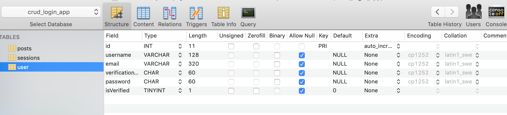
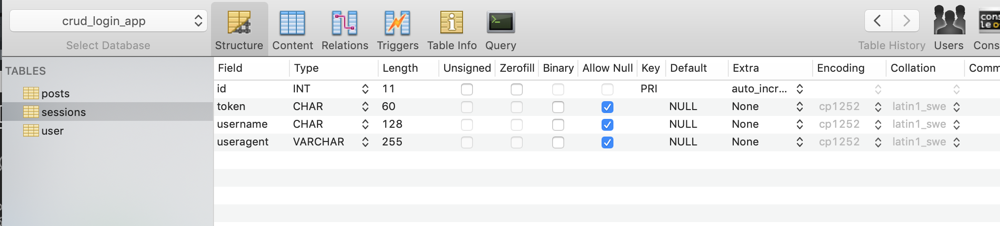
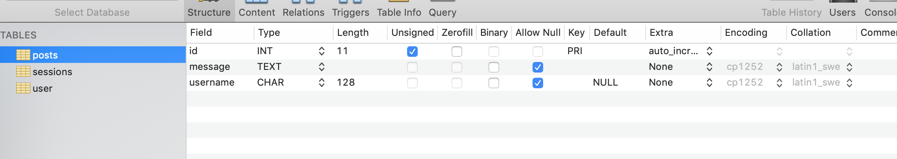

This vanilla node app has CRUD and logins. Though it works, there are some changes I could make:

  - My database helpers should be more uniform. They should probably all return the results of the query and I should handle the results from the function call. Instead, the results are handled in some of the helpers, which makes it hard to remember what the helper is going to return to the function call.
  - Some catch statements are missing.
  - I used some `async function`s for my API endpoints and some `new Promise` constructors. In production, I'd stick to one or the other to make the code more uniform and easier to read. But in this project I played with both for practice.

## How to use:

There isn't much of a frontend. To see the api in action, use the 'bin/tests' file and uncomment the API fetch call you want to test. The APIs send back information that gets logged to the console.

You'll need to add a `.env` file with the following variables. I used gmail for the email verification. You need to get an "app password" to use Gmail with `nodemailer`. 
```
HOST = '555.555.55.555'
DBUSER = 'databaseuser'
PASSWORD = 'databaseuserpassword'
DATABASE = 'databasename'
GMAIL = 'some@gmail.com'
GMAILPW = 'somegmailapppassword'
```

## Table Setup:
### User

### Sessions

### Posts



